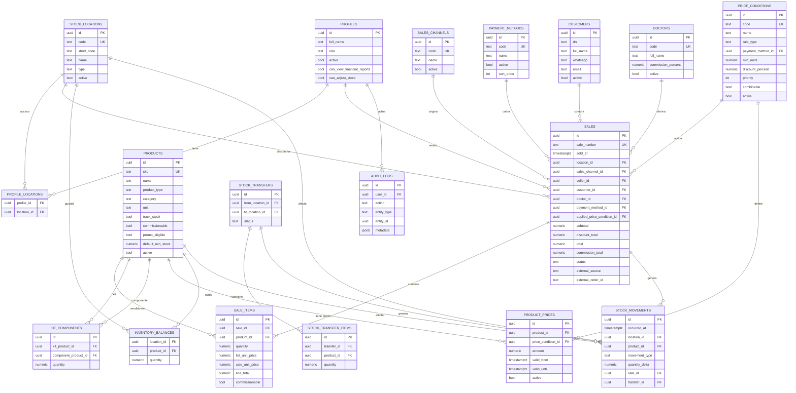

# Arquitectura — Maguirejuve Ventas

## 1. Stack

| Capa | Tecnología |
|---|---|
| Frontend | Next.js 16 (App Router), React 19, TypeScript estricto |
| UI | Tailwind CSS v4, shadcn/ui |
| Backend de datos | Supabase (PostgreSQL, Auth, RLS, RPC/Database Functions) |
| Hosting | Vercel (app) + Supabase (DB/Auth) |
| Validación | Zod (frontend y server actions) |
| Tests | Vitest (unit/integration), Playwright (E2E) |
| CI | GitHub Actions |

Zona horaria de negocio: `America/Argentina/Buenos_Aires`. Moneda: ARS. Todo importe es `numeric(14,2)`.

## 2. Principio rector

**El navegador nunca calcula el precio final ni descuenta stock.** El frontend solo muestra una
estimación (llamando al mismo RPC de solo-lectura que usa el backend). La confirmación de una venta
ejecuta `create_sale(...)`, una función `SECURITY DEFINER` en PostgreSQL que:

1. revalida permisos y ubicación del vendedor,
2. vuelve a consultar precios vigentes,
3. vuelve a determinar la condición de precio aplicable,
4. bloquea (`FOR UPDATE`) las filas de inventario involucradas,
5. valida stock (expandiendo kits en sus componentes),
6. escribe venta + detalle + movimientos de stock + comisión,
7. o revierte todo si cualquier paso falla (transacción atómica).

Ninguna cantidad "final" (subtotal, descuento, total, comisión, movimiento de stock) se acepta desde
el cliente. El cliente solo envía: productos + cantidades, medio de pago, sucursal/canal, cliente y
doctora opcionales.

## 3. Modelo de datos (resumen)

Ver el detalle completo (columnas, constraints, índices) en `docs/database.md` y en
`supabase/migrations/`. Los conceptos clave:

- **`stock_locations`**: dónde vive físicamente el stock (Sede 37, Sede 25). No confundir con canal.
- **`sales_channels`**: cómo se originó la venta (Sucursal, Web). Una venta Web indica además
  `location_id` de despacho (`fulfillment_location`).
- **`products`** + **`kit_components`**: catálogo. Los kits (`track_stock = false`) descuentan stock
  de sus componentes, nunca de un contador propio.
- **`price_conditions`** + **`product_prices`**: el motor de precios. Los precios son historizados
  (`valid_from` / `valid_until`); cambiar un precio hoy nunca reescribe una venta pasada porque
  `sale_items` guarda un snapshot.
- **`sales`** + **`sale_items`**: cabecera y detalle de venta. `sale_number` es legible
  (`MJ-<sede>-<fecha>-<secuencia>`).
- **`inventory_balances`**: saldo actual por sede/producto — es una vista materializada del ledger,
  nunca se edita a mano.
- **`stock_movements`**: ledger auditable. Todo cambio de `inventory_balances` proviene de un
  movimiento con signo (`quantity_delta`).
- **`stock_transfers`** + **`stock_transfer_items`**: transferencias atómicas entre sedes.
- **`customers`**, **`doctors`**: opcionales en una venta.
- **`profiles`** + **`profile_locations`**: usuarios y a qué sedes tienen acceso (incluso los admin).
- **`audit_logs`**: bitácora de acciones sensibles.
- **`app_settings`**: parámetros de negocio (fila única).

### Diagrama entidad-relación



## 4. Motor de precios (`pricing-engine`)

Implementado **una sola vez, en SQL** (`fn_pricing_quote`, ver `docs/pricing.md`), y expuesto a través
de dos caminos que comparten exactamente la misma función:

- `quote_sale(...)` — RPC de solo lectura, la usa el frontend para mostrar la estimación en tiempo
  real mientras la vendedora arma el carrito.
- `create_sale(...)` — llama internamente a `fn_pricing_quote` y si el resultado es válido, persiste.

Existe además un espejo en TypeScript puro (`lib/pricing/engine.ts`) usado para:
- tests unitarios rápidos sin base de datos (los 12 casos de la sección 41 del prompt),
- tipos compartidos (`PricingInput`, `PricingResult`) entre frontend y backend.

El módulo TypeScript **no decide ventas reales** — es documentación ejecutable de la regla de negocio
y un espejo para test; la fuente de verdad en producción es siempre la función SQL.

Precedencia (configurable vía `price_conditions.priority`, menor número = mayor precedencia):

1. `QTY_3_PLUS` (3+ productos)
2. `QTY_2` (2 productos)
3. `CASH` (efectivo)
4. `TRANSFER` (transferencia)
5. `INSTALLMENTS_3` (3 cuotas)
6. `LIST` (lista — siempre aplica, es el fallback)

Las condiciones **no se acumulan**: se elige la de mayor precedencia cuya regla matchea
(`rule_type = 'QUANTITY'` con `total_qty >= min_units`, o `rule_type = 'PAYMENT_METHOD'` con el medio
de pago elegido, o `rule_type = 'BASE'` que siempre matchea). Una vez elegida la condición, **se
exige** que exista un precio válido, positivo y vigente para *cada* producto del carrito bajo esa
condición exacta — si falta, la venta se rechaza (nunca se sustituye por otra condición ni por $0).

## 5. Inventario

`inventory_balances` es un **caché derivado** del ledger `stock_movements`. Todo movimiento de stock
(venta, cancelación, ajuste, transferencia, ingreso) pasa por `stock_movements` y actualiza el saldo
dentro de la misma transacción. Los kits nunca tienen saldo propio: su disponibilidad se calcula al
vuelo (`fn_kit_buildable_qty`) como el mínimo, entre sus componentes, de `saldo / cantidad requerida`.

## 6. Permisos y RLS

Dos roles (`admin`, `seller`), acceso a sedes vía `profile_locations` (ambos roles pueden estar
restringidos a un subconjunto de sedes). RLS habilitada en toda tabla expuesta al cliente; el
`service_role` nunca llega al navegador. Detalle de policies en `docs/database.md` §RLS.

## 7. Estructura del repositorio

```
app/                        # Next.js App Router
  (auth)/login/
  (app)/dashboard/
  (app)/ventas/[nueva|[id]]
  (app)/stock/[movimientos]
  (app)/clientes/
  (app)/admin/[precios|promociones|doctores|usuarios]
  api/integrations/web-orders/
components/
  ui/                        # shadcn/ui primitives
  sales/ inventory/ dashboard/ shared/
lib/
  supabase/                  # browser/server/proxy clients
  pricing/                   # motor de precios TS (espejo + tests)
  inventory/                 # helpers de expansión de kits, formato
  permissions/
  validation/                # esquemas Zod
  utils/
types/
supabase/
  migrations/
  seed.sql
tests/
docs/
```

## 8. Fases de implementación

Ver checklist en el README. Este documento se actualiza si el esquema cambia.
